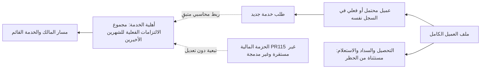
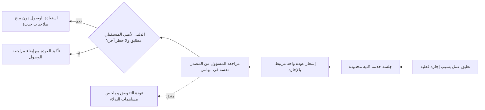
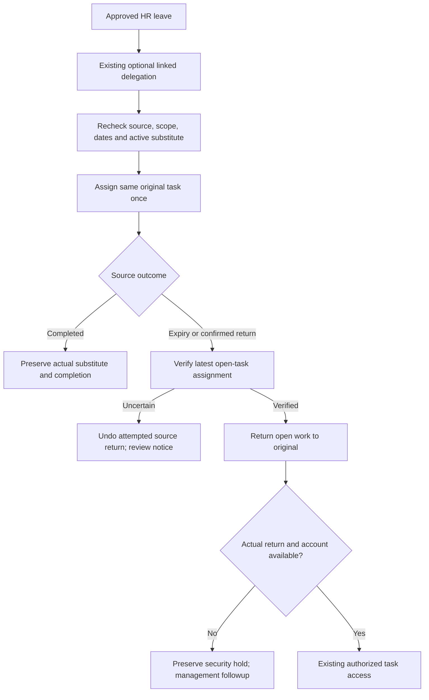

# تدفقات النسخة التشغيلية — نطاق المراجعة

الرسوم تشرح مصدر الحالة، وليست إثباتاً على نشر أو اكتمال البنود الموضحة «متبقي».

```mermaid
flowchart RL
  A[ملف العميل الكامل] --> B[عميل محتمل أو فعلي في السجل نفسه]
  B --> C[طلب خدمة جديد]
  C -. ربط محاسبي متبقٍ .-> D[أهلية الخدمة: مجموع الالتزامات الفعلية للشهرين الأخيرين]
  D --> E[مسار المالك والخدمة القائم]
  A --> F[التحصيل والسداد والاستعلام: مستثناة من الحظر]
  G[الحزمة المالية PR115 غير مستقرة وغير مدمجة] -. تبعية دون تعديل .-> D
```

```mermaid
flowchart RL
  A[تعليق عمل بسبب إجازة فعلية] --> B[جلسة خدمة ذاتية محدودة]
  B --> C[إشعار عودة واحد مرتبط بالإجازة]
  C --> D[مراجعة المسؤول من المصدر نفسه في مهامي]
  D --> E{الدليل الأمني المستقبلي مطابق ولا حظر آخر؟}
  E -->|نعم| F[استعادة الوصول دون منح صلاحيات جديدة]
  E -->|لا| G[تأكيد العودة مع إبقاء مراجعة الوصول]
  D -. متبقٍ .-> H[عودة التفويض وملخص مساهمات البدلاء]
```

```mermaid
flowchart RL
  A[موعد دقيق يراجعه مسؤول مخول] --> B[المهمة الأصلية وجدول الموظف المؤرخ]
  C[الانتظار والإجازة الفعلية المعتمدان] --> B
  B --> D[متابعة HR القائمة]
  D --> E{المصدر والتسلسل مكتملان؟}
  E -->|لا| F[تحتاج مراجعة؛ لا توقيت مفترض]
  E -->|نعم| G[30 ثم60 دقيقة عمل: إشعار للمستوى الحقيقي]
  G --> H[منع التكرار؛ لا مهمة جديدة أو عقوبة مالية]
```

## Existing leave-linked delegation

```mermaid
flowchart TD
 A[Approved HR leave] --> B[Existing optional linked delegation]
 B --> C[Recheck source, scope, dates and active substitute]
 C --> D[Assign same original task once]
 D --> E{Source outcome}
 E -->|Completed| F[Preserve actual substitute and completion]
 E -->|Expiry or confirmed return| G[Verify latest open-task assignment]
 G -->|Uncertain| H[Undo attempted source return; review notice]
 G -->|Verified| I[Return open work to original]
 I --> J{Actual return and account available?}
 J -->|No| K[Preserve security hold; management followup]
 J -->|Yes| L[Existing authorized task access]
```
